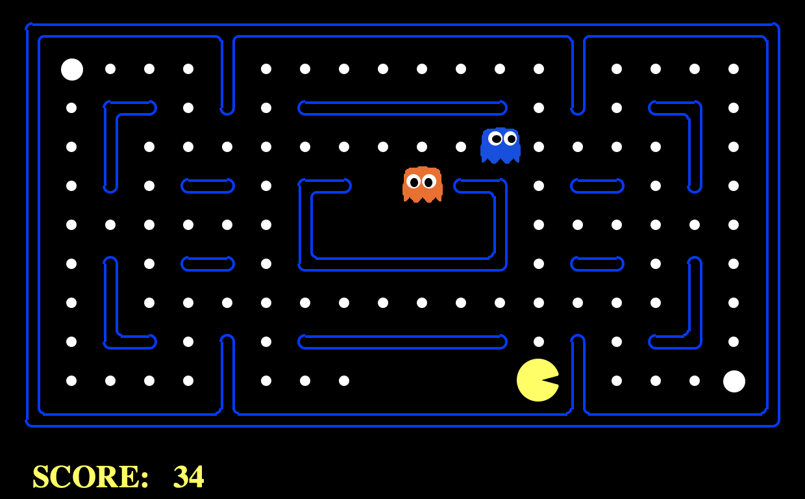

# 人工智能导论第一次作业-搜索实践

### 介绍

”[吃豆人]((https://en.wikipedia.org/wiki/Pac-Man))“是一款大家耳熟能详的游戏，本次作业要求大家结合课上学习的搜索相关知识，逐步实现自己的吃豆人AI。请认真阅读此文档，并依次运行**使用说明**中相关命令。


### 文件结构

你需要编辑的文件：

* search.py: 包含待实现的搜索规划算法。
* searchAgents.py: 吃豆人的AI实现。
* multiAgents.py: 带博弈的吃豆人的AI实现。

你可能需要查看的文件：

* utils.py: 包含一些有用的数据结构。

* pacman.py: 你可以只关注描述游戏状态的的```GameState```类型。
* game.py: 你可以只关注```AgentState, Agent, Direction, Grid```等类型。

其他文件为其他底层逻辑和评测代码的实现，可忽略。


### 使用说明

进入目录，输入以下命令来运行吃豆人游戏：

```
python pacman.py
```



吃豆人的经典规则：吃豆人吃到豆子会得分，随时间的推移分数会逐渐减少，遇到怪物或吃完所有食物则游戏结束，即吃豆人要在尽短的时间内吃掉所有食物（游戏中还存在一些小道具，例如Capsule，但不在本次作业的考虑范围内）。


项目中已经实现了一个最简单的AI，运行以下命令进行测试：

```
python pacman.py --layout testMaze --pacman GoWestAgent
```

```GoWestAgent```是一个只会向左走的AI，你可以在```searchAgents.py```找到它的实现。在```testMaze```迷宫中，它似乎表现还不错，但在```tinyMaze```里就显得不那么智能，运行命令：

```
python pacman.py --layout tinyMaze --pacman GoWestAgent
```

以上命令展示了```pacman.py```支持的某些命令行参数：

* ```--layout```（或```-l```）：选择特定的迷宫，```layouts/```文件夹包含部分迷宫资源，```%```符号表示墙体，```P```表示起点，```.```表示食物，```G```代表怪物。

* ```--pacman```（或```-p```）：指定要使用的游戏AI，默认为```KeyboardAgent```，即键盘输入。

查看更详细的参数说明可运行：

``````
python pacman.py -h
``````


#### 作业一

利用课上学习的搜索算法，实现一个通用的```SearchAgent```。首先我们将问题简化为：**不考虑怪物，让吃豆人吃到迷宫中的一个食物**，即到达迷宫上的一个特定位置，我们已经在```searchAgents.py```中为你写好了```SearchAgent```类的框架，它通过搜索算法得出到达目标的路径，依次执行动作（上下左右停止）并进行游戏界面的更新。其中，**搜索算法需要由你来实现**。

首先我们测试```SearchAgent```是否运行正常：

````
python pacman.py -l tinyMaze -p SearchAgent -a fn=tinyMazeSearch
````

吃豆人成功抵达了终点，你可以在```search.py```找到```tinyMazeSearch```的实现。可以发现，它只是硬编码了在```tinyMaze```中从起点到终点的路径。

* ```-a```：在选择```SearchAgent```作为AI时，使用该选项来接受```key=value```的字典对，用来指定```SearchAgent```使用的算法和启发函数等。例如```fn```选项：
  * ```fn=dfs```: 深度优先搜索。
  * ``` fn=bfs```: 广度优先搜索。
  * ``` fn=astar```：A*启发搜索。

##### 作业要求

在```search.py```文件中实现```depthFirstSearch```,```breadthFirstSearch```,``aStarSearch``三种**图搜索算法**，**所有搜索算法均返回一个动作列表**（参考```tinyMazeSearch```），通过执行这些动作可以使吃豆人从起点抵达终点。

##### 提示

* 请仔细阅读```search.py```文件中的注释，其中```SearchProblem```是一个抽象类，定义了```problem```对象的一系列接口方法，请在实现搜索算法时尽可能调用```SearchProblem```的接口。你可以在```searchAgents.py```的```PositionSearchProblem```找到它的具体实现。
* 请尽量使用```utils.py```中定义好的数据结构，使用自定义的数据结构或第三方库可能存在不兼容。
* 我们在```searchAgents.py```为你提供了```aStarSearch```所需的启发函数```manhattanHeuristic```，你可以通过命令行选项```-a heuristic=manhattanHeuristic```指定，你也可以设计其他启发函数，并在文档中说明。
* 实现之后，你可以运行以下命令，对```layouts/```中以```Maze```结尾的迷宫进行测试，例如：

```
python pacman.py -l tinyMaze -p SearchAgent -a fn=dfs
python pacman.py -l mediumMaze -p SearchAgent -a fn=bfs
python pacman.py -l bigMaze -z .5 -p SearchAgent -a fn=astar,heuristic=manhattanHeuristic
```
* 若游戏画面更新较慢，可以尝试添加命令行选项```--frameTime 0```。
* 请确保你的搜索算法是图搜索算法。


#### 作业二 (35 Points)

作业一中，我们只关注吃豆人到迷宫中一个食物的路径。现在我们提高一些难度：**不考虑怪物，迷宫中存在一个以上的食物，要求吃掉迷宫中所有的食物**，你可以在```searchAgents.py```的```FoodSearchProblem```中查看对这个问题的定义（和```PositionSearchProblem```的区别主要在于状态定义的不同）。

我们尝试使用A*算法来解决这个问题，如果你在作业一中已经正确实现了该算法，运行以下命令：

```
python pacman.py -l foodSearch -p SearchAgent -a fn=astar,prob=FoodSearchProblem,heuristic=foodHeuristic
```

我们使用了```searchAgents.py```中的```foodHeuristic```启发函数（永远返回0），此时A*算法等价于Uniform Cost Search。结果显示，在UCS算法下吃豆人在60步之内吃掉了所有的食物，但总计扩展了多达16688个节点。

##### 作业要求

你需要设计一个新的启发函数，修改```searchAgents.py```中的```foodHeuristic```，并在文档中说明你的启发函数是良定义的（Consistency），运行以下命令：

```
python pacman.py -l foodSearch -p SearchAgent -a fn=astar,prob=FoodSearchProblem,heuristic=foodHeuristic
```

根据你的启发函数**扩展的节点数目**，你可以在作业二中获得以下分数：

| 扩展节点数目   | 得分                   |
| -------------- | ---------------------- |
| >15000         | 12                     |
| (12000, 15000] | 15                     |
| (9000, 12000]  | 18                     |
| (7000, 9000]   | 21                     |
| <7000          | 27 （6 points bonus） |


#### 作业三 (30 Points)

我们考虑**地图中存在怪物，并且不止一个**的情况，吃豆人的目标是获取尽量高的分数，而怪物们的目标阻止吃豆人获得高分，这是一个经典的博弈问题。

##### 作业要求

请在```multiAgents.py```中实现`MinimaxAgent`和```AlphaBetaAgent```的类中的```getAction```方法，分别实现简单Minimax算法和带Alpha-Beta剪枝的Minimax算法，我们鼓励大家自己设计迷宫测试，测试命令为：

```
python pacman.py -p MinimaxAgent -l YOUR_MAZE_NAME -a depth=3
```

* ```depth=3```，指定了```Minimax```搜索树的决策深度，我们假设在吃豆人做出决策后，剩下的所有怪物依次做出决策，如此一轮后决策深度加一。根据你的算法效率，可以指定其他值。

##### 提示

* 请仔细阅读```multiAgents.py```文件中的注释；并查看```pacman.py```中```GameState```类的接口实现，请尽量调用这些接口。
* ```Minimax```树叶节点的```Utility```评估就是游戏界面中显示的分数，不需要大家实现。如果你正确实现了Minimax算法，在```trappedClassic```迷宫中，吃豆人会首先冲向离它最近的怪物（为什么？）
* 由于需要考虑多个怪物的情况，因此在```Minimax```搜索树中，一个```MAX```节点下依次有多层对应的```MIN节点```。
* 在Minimax算法中我们假定了怪物每次都采取让吃豆人获得最低分数的动作，但实际上怪物的运动会存在一定的随机性，所以吃豆人按照Minimax算法并不一定每次都能获胜（考虑Expectimax算法？）


### 最终提交

* 代码部分：只需提交修改后的**search.py**, **searchAgents.py**, **multiAgents.py**，**请不要修改这三个文件中的方法和类签名，以及项目中其他文件**。
* 文档部分，不超过两页，至少应包含如下内容：
  * 作业一：对比并分析在不同规模迷宫下，各算法的**搜索算法用时，展开节点数，路径代价**等指标。
  * 作业二：说明你的启发函数是良定义的：非负，一致性，并且在目标状态下的值为0。
  * 作业三：上传自己设计的迷宫```.lay```文件，以及你所实现的对抗算法在这个迷宫中的运行效果录屏。
  


### 评分标准 (60 Points with 6 Bonus)

* 作业一（21 Points）
  * 正确实现```depthFirstSearch```,```breadthFirstSearch```：一种得6 Points，两种得9 Points。
  * 正确实现```aStarSearch```：6 Points。
  * 文档分析：满分6 Points。
* 作业二（21 Points）
  * 按作业二表格和相应文档说明给分（6 Points Bonus）。
  * 若未在文档中证明你的启发函数是良定义的，作业二得分为0。
* 作业三（18 Points）
  * 正确实现Minimax算法：9 Points。
  * Alpha-Beta剪枝的实现：9 Points。


如果大家在项目中遇到任何问题，欢迎在课程微信群中讨论 。


